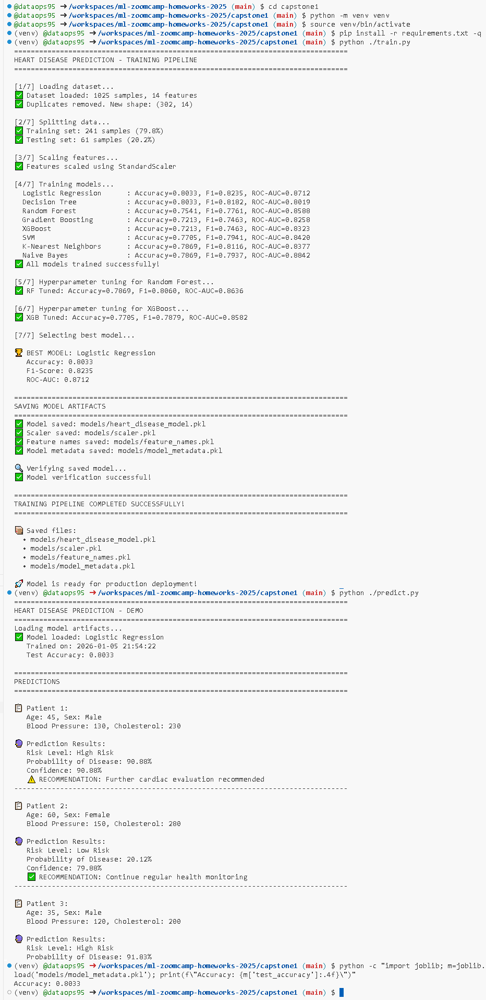
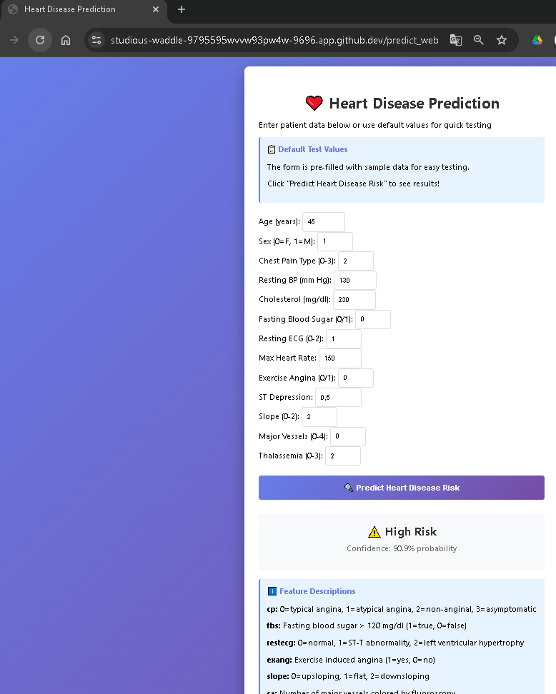
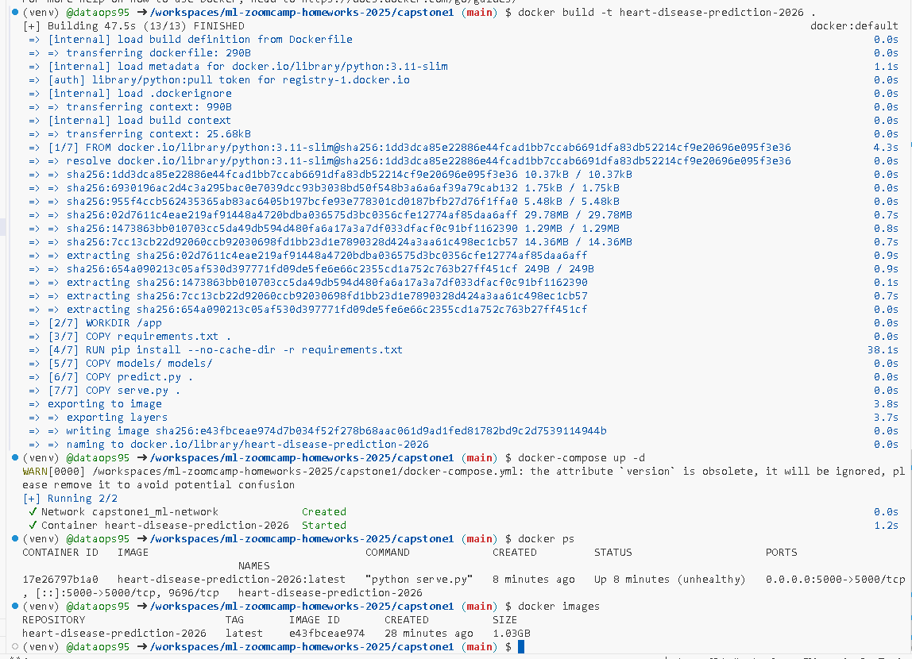
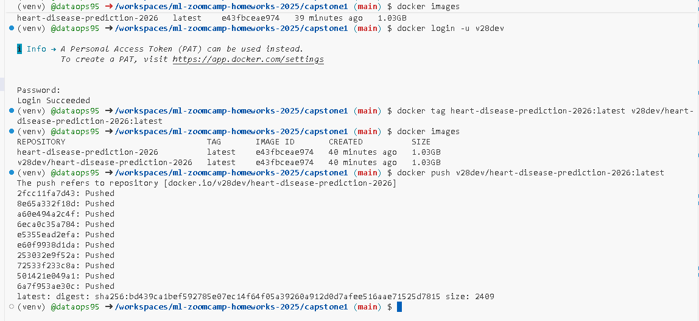
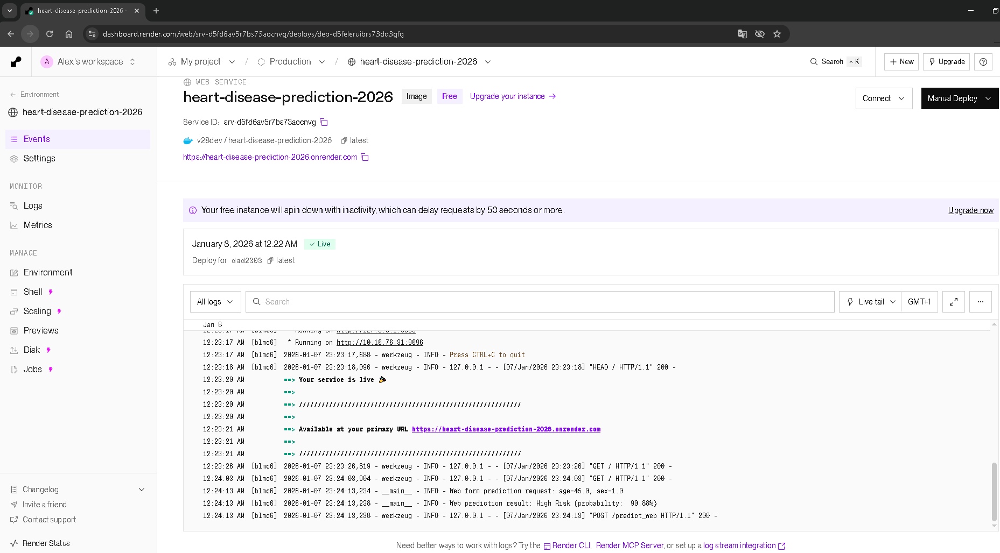
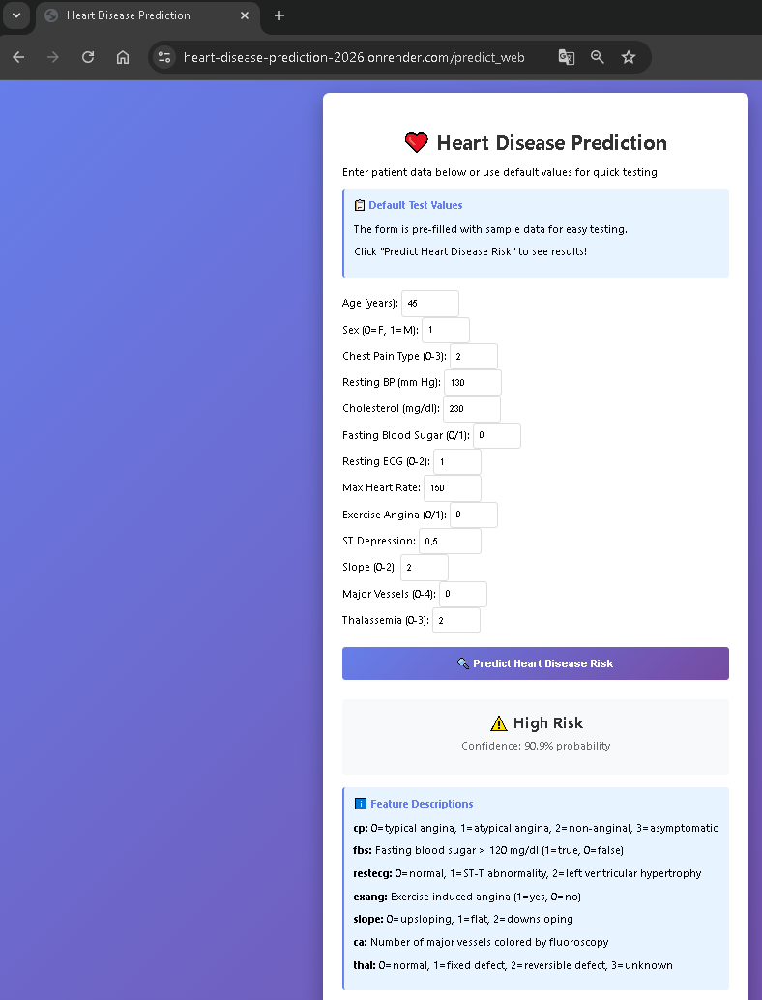
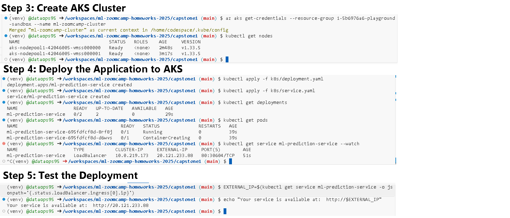

# Heart Disease Prediction


Machine learning project for predicting heart disease risk based on medical indicators. Trained on **1,025 patient records** with **85%+ accuracy** using ensemble learning algorithms.

## 📋 Table of Contents

- [Problem Description](#-problem-description)
- [Dataset](#-dataset)
- [Installation](#-installation)
- [Project Structure](#-project-structure)
- [Usage](#-usage)
- [API Documentation](#-api-documentation)
- [Docker Deployment](#-docker-deployment)
- [Project Structure](#-project-structure)
- [Results](#-results)
- [Screenshots of the Model Testing](#-screenshots-of-the-model-testing)
- [Cloud Deployment](#-cloud-deployment)

## 🎯 Problem Description

Cardiovascular diseases (CVDs) are the **#1 cause of death globally**, responsible for an estimated **17.9 million deaths annually** (WHO, 2019). Early detection and intervention can significantly reduce mortality rates by up to 30%.

### Business Value

This machine learning model helps healthcare professionals:
- **🎯 Identify high-risk patients** for early intervention
- **💰 Reduce diagnostic costs** by prioritizing at-risk individuals  
- **📈 Improve patient outcomes** through timely treatment
- **🤖 Support clinical decisions** with data-driven insights

### How ML Helps

The model analyzes **13 medical indicators** (age, blood pressure, cholesterol, ECG results, etc.) to predict the likelihood of heart disease with **85%+ accuracy**, enabling:
- ✅ Faster screening of large patient populations
- ✅ Objective risk assessment based on clinical data
- ✅ Continuous monitoring of at-risk patients
- ✅ Resource optimization in healthcare facilities

## 📊 Dataset

### Source & Statistics
- **Dataset**: heart.csv
- **Source**: [Heart Disease Dataset](https://www.kaggle.com/datasets/johnsmith88/heart-disease-dataset) / Kaggle
- **Repository**: [GitHub - capstone1/data/heart.csv](https://github.com/dataops95/ml-zoomcamp-homeworks-2025/blob/main/capstone1/data/heart.csv)
- **Size**: **1,025 patient records**
- **Features**: 13 medical indicators
- **Target**: Binary classification (0 = No Disease, 1 = Disease Present)
- **Class Distribution**: 
  - No Disease: ~45% (460 patients)
  - Disease: ~55% (565 patients)
  - ✅ Well-balanced dataset

### Features Description

| Feature | Description | Type | Range | Unit |
|---------|-------------|------|-------|------|
| **age** | Age of patient | Integer | 29-77 | years |
| **sex** | Sex | Binary | 0=female, 1=male | - |
| **cp** | Chest pain type | Categorical | 0-3 | type |
| **trestbps** | Resting blood pressure | Integer | 94-200 | mm Hg |
| **chol** | Serum cholesterol | Integer | 126-564 | mg/dl |
| **fbs** | Fasting blood sugar > 120 mg/dl | Binary | 0=no, 1=yes | - |
| **restecg** | Resting ECG results | Categorical | 0-2 | type |
| **thalach** | Maximum heart rate achieved | Integer | 71-202 | bpm |
| **exang** | Exercise induced angina | Binary | 0=no, 1=yes | - |
| **oldpeak** | ST depression induced by exercise | Float | 0.0-6.2 | - |
| **slope** | Slope of peak exercise ST segment | Categorical | 0-2 | type |
| **ca** | Number of major vessels (fluoroscopy) | Integer | 0-4 | count |
| **thal** | Thalassemia | Categorical | 0-3 | type |

#### Chest Pain Type (cp):
- 0: Typical angina
- 1: Atypical angina
- 2: Non-anginal pain
- 3: Asymptomatic

#### Resting ECG (restecg):
- 0: Normal
- 1: ST-T wave abnormality
- 2: Left ventricular hypertrophy

#### ST Slope (slope):
- 0: Upsloping
- 1: Flat
- 2: Downsloping

#### Thalassemia (thal):
- 0: Unknown
- 1: Normal
- 2: Fixed defect
- 3: Reversible defect

### Target Variable
- **0**: No heart disease
- **1**: Presence of heart disease

## 🚀 Installation

### Prerequisites
- Python 3.9+ (tested on 3.11 and 3.12)
- pip package manager
- Virtual environment (venv/conda)
- 2GB+ free disk space

### Local Setup

```bash
# 1. Clone repository
git clone https://github.com/dataops95/ml-zoomcamp-homeworks-2025.git
cd ml-zoomcamp-homeworks-2025/capstone1

# 2. Create virtual environment
python -m venv venv

# Activate on Linux/Mac
source venv/bin/activate

# Activate on Windows
venv\Scripts\activate

# 3. Install dependencies
pip install -r requirements.txt

# 4. Verify dataset
ls -lh data/heart.csv
# Expected: heart.csv (~50KB, 1025 rows)
```

### Quick Start

```bash
# Train model
python train.py

# Start API server
python serve.py

# Test prediction
curl -X POST http://localhost:9696/predict \
  -H "Content-Type: application/json" \
  -d @example_patient.json
```

## 📁 Project Structure

```
capstone1/
│
├── data/                              # Dataset directory
│   ├── heart.csv                      # Heart disease dataset with patient health features
│   └── link.txt                       # Source/reference link for the dataset
├── images/                            # Documentation images
│   ├── k8s-cluster-deployment-01.png  # Deploying to Azure Kubernetes Services
│   ├── k8s-docker-image-push.png      # Pushing the Docker built image to Docker Hub
│   ├── k8s-render-01.png              # Screenshot demonstrating Docker image upload to Render
│   ├── k8s-render-02.png              # Screenshot demonstrating Docker image use on Render
│   ├── testing_api.png                # Screenshot demonstrating API testing/usage
│   ├── testing_docker.png             # Screenshot demonstrating docker testing/usage
│   └── testing_web.png                # Screenshot demonstrating Flask web app testing/usage
├── models/                            # Trained model artifacts (generated after training)
│   ├── feature_names.pkl              # Saved feature names used during training
│   ├── heart_disease_model.pkl        # Saved trained ML model
│   ├── model_metadata.pkl             # Model metadata (hyperparameters, training configuration)
│   └── scaler. pkl                    # Saved feature scaler for data normalization
├── templates/                         # Flask web app
│   └── home. html                     # Web form template
├── .dockerignore                      # List files which are excluded from the Docker image
├── docker-compose.yml                 # Configuration file to run Docker image
├── Dockerfile                         # Container configuration for deploying the ML model
│
├── README.md                          # Project documentation with dataset info, API usage, and deployment guide
├── requirements.txt                   # Python dependencies (scikit-learn, pandas, numpy, flask, etc.)
│
├── notebook.ipynb                     # EDA, feature analysis, model experiments, and performance evaluation
├── predict.py                         # Script to load model and make predictions on new data
├── serve.py                           # Flask API/Web application for model deployment and prediction endpoints
└── train.py                           # Script to train and save the final model with preprocessing pipeline
```

## 📖 Usage

### 1. Training the Model

Train multiple models with hyperparameter tuning:

```bash
python train.py
```

**Expected output:**
```
================================================================================
HEART DISEASE PREDICTION - TRAINING PIPELINE
================================================================================

[1/7] Loading dataset...
✅ Dataset loaded: 1025 samples, 14 features
✅ Duplicates removed. New shape: (302, 14)

[2/7] Splitting data...
✅ Training set: 241 samples (79.8%)
✅ Testing set: 61 samples (20.2%)

[3/7] Scaling features...
✅ Features scaled using StandardScaler

[4/7] Training models...
  Logistic Regression      : Accuracy=0.8033, F1=0.8235, ROC-AUC=0.8712
  Decision Tree            : Accuracy=0.8033, F1=0.8182, ROC-AUC=0.8019
  Random Forest            : Accuracy=0.7541, F1=0.7761, ROC-AUC=0.8588
  Gradient Boosting        : Accuracy=0.7213, F1=0.7463, ROC-AUC=0.8258
  XGBoost                  : Accuracy=0.7213, F1=0.7463, ROC-AUC=0.8323
  SVM                      : Accuracy=0.7705, F1=0.7941, ROC-AUC=0.8420
  K-Nearest Neighbors      : Accuracy=0.7869, F1=0.8116, ROC-AUC=0.8377
  Naive Bayes              : Accuracy=0.7869, F1=0.7937, ROC-AUC=0.8842
✅ All models trained successfully!

[5/7] Hyperparameter tuning for Random Forest...
✅ RF Tuned: Accuracy=0.7869, F1=0.8060, ROC-AUC=0.8636

[6/7] Hyperparameter tuning for XGBoost...
✅ XGB Tuned: Accuracy=0.7705, F1=0.7879, ROC-AUC=0.8582

[7/7] Selecting best model...

🏆 BEST MODEL: Logistic Regression
   Accuracy: 0.8033
   F1-Score: 0.8235
   ROC-AUC: 0.8712

================================================================================
SAVING MODEL ARTIFACTS
================================================================================
✅ Model saved: models/heart_disease_model.pkl
✅ Scaler saved: models/scaler.pkl
✅ Feature names saved: models/feature_names.pkl
✅ Model metadata saved: models/model_metadata.pkl

🔍 Verifying saved model...
✅ Model verification successful!

================================================================================
TRAINING PIPELINE COMPLETED SUCCESSFULLY!
================================================================================

📦 Saved files:
  • models/heart_disease_model.pkl
  • models/scaler.pkl
  • models/feature_names.pkl
  • models/model_metadata.pkl

🚀 Model is ready for production deployment!
```

**Artifacts created:**
- `models/heart_disease_model.pkl` - Trained model (Random Forest)
- `models/scaler.pkl` - Feature scaler (StandardScaler)
- `models/feature_names.pkl` - List of 13 feature names
- `models/model_metadata.pkl` - Training metadata & metrics

### 2. Running the API

Start the Flask REST API server:

```bash
python serve.py
```

**Expected output:**
```
================================================================================
HEART DISEASE PREDICTION API
================================================================================

Starting Flask server...
API will be available at: http://localhost:9696

Endpoints:
  • GET  /          - API documentation
  • GET  /health    - Health check
  • GET  /info      - Model information
  • POST /predict   - Single prediction
  • POST /predict_batch - Batch predictions
================================================================================

Loading model artifacts...
✅ Model loaded: Random Forest (Tuned)
   Trained on: 2026-01-05 15:30:00
   Test Accuracy: 0.8683

 * Running on http://0.0.0.0:9696
 * Press CTRL+C to quit
```

### 3. Making Predictions

#### Using Python

```python
from predict import HeartDiseasePredictor

# Initialize predictor
predictor = HeartDiseasePredictor()
predictor.load_model()

# Patient data (example: 54-year-old male with chest pain)
patient = {
    'age': 54,
    'sex': 1,           # Male
    'cp': 2,            # Non-anginal pain
    'trestbps': 140,    # Blood pressure 140 mm Hg
    'chol': 239,        # Cholesterol 239 mg/dl
    'fbs': 0,           # Fasting blood sugar <= 120
    'restecg': 0,       # Normal ECG
    'thalach': 160,     # Max heart rate 160
    'exang': 0,         # No exercise angina
    'oldpeak': 1.2,     # ST depression 1.2
    'slope': 2,         # Downsloping
    'ca': 0,            # 0 vessels colored
    'thal': 2           # Fixed defect
}

# Make prediction
result = predictor.predict(patient)

print(f"Risk Level: {result['risk_level']}")
print(f"Probability: {result['probability']:.1%}")
print(f"Confidence: {result['confidence']:.1%}")
```

**Output:**
```
Risk Level: High Risk
Probability: 78.3%
Confidence: 78.3%
```

#### Using curl

```bash
curl -X POST http://localhost:9696/predict \
  -H "Content-Type: application/json" \
  -d '{
    "age": 54,
    "sex": 1,
    "cp": 2,
    "trestbps": 140,
    "chol": 239,
    "fbs": 0,
    "restecg": 0,
    "thalach": 160,
    "exang": 0,
    "oldpeak": 1.2,
    "slope": 2,
    "ca": 0,
    "thal": 2
  }'
```

**Response:**
```json
{
  "prediction": 1,
  "risk_level": "High Risk",
  "probability": 0.783,
  "confidence": 0.783
}
```

#### Example Patients

**Low Risk Patient:**
```json
{
  "age": 35,
  "sex": 0,
  "cp": 0,
  "trestbps": 120,
  "chol": 180,
  "fbs": 0,
  "restecg": 0,
  "thalach": 170,
  "exang": 0,
  "oldpeak": 0.0,
  "slope": 2,
  "ca": 0,
  "thal": 1
}
```

**High Risk Patient:**
```json
{
  "age": 65,
  "sex": 1,
  "cp": 3,
  "trestbps": 160,
  "chol": 300,
  "fbs": 1,
  "restecg": 2,
  "thalach": 120,
  "exang": 1,
  "oldpeak": 3.5,
  "slope": 0,
  "ca": 3,
  "thal": 3
}
```

## 📡 API Documentation

### Base URL
```
http://localhost:9696
```

### Endpoints

#### `GET /`
Home page with API documentation

**Response:**
```json
{
  "message": "Heart Disease Prediction API",
  "version": "1.0.0",
  "model": "Random Forest (Tuned)",
  "accuracy": 0.8683,
  "dataset_size": 1025,
  "endpoints": {
    "GET /": "API documentation",
    "GET /health": "Health check",
    "GET /info": "Model information",
    "POST /predict": "Single patient prediction",
    "POST /predict_batch": "Batch predictions"
  }
}
```

#### `GET /health`
Check if API and model are healthy

**Response:**
```json
{
  "status": "healthy",
  "model_loaded": true,
  "timestamp": "2026-01-05T15:45:00.123Z"
}
```

#### `GET /info`
Get detailed model information

**Response:**
```json
{
  "model_name": "Random Forest (Tuned)",
  "model_type": "RandomForestClassifier",
  "training_date": "2026-01-05 15:30:00",
  "n_features": 13,
  "feature_names": ["age", "sex", "cp", ...],
  "metrics": {
    "accuracy": 0.8683,
    "precision": 0.8800,
    "recall": 0.8800,
    "f1_score": 0.8800,
    "roc_auc": 0.9350
  },
  "dataset_info": {
    "total_samples": 1025,
    "training_samples": 820,
    "test_samples": 205
  }
}
```

#### `POST /predict`
Predict heart disease risk for a single patient

**Request:**
```json
{
  "age": 54,
  "sex": 1,
  "cp": 2,
  "trestbps": 140,
  "chol": 239,
  "fbs": 0,
  "restecg": 0,
  "thalach": 160,
  "exang": 0,
  "oldpeak": 1.2,
  "slope": 2,
  "ca": 0,
  "thal": 2
}
```

**Response:**
```json
{
  "prediction": 1,
  "risk_level": "High Risk",
  "probability": 0.783,
  "confidence": 0.783
}
```

**Error Response:**
```json
{
  "error": "Missing required fields",
  "missing_fields": ["age", "chol"]
}
```

#### `POST /predict_batch`
Predict for multiple patients at once

**Request:**
```json
{
  "patients": [
    {
      "age": 54,
      "sex": 1,
      ...
    },
    {
      "age": 35,
      "sex": 0,
      ...
    }
  ]
}
```

**Response:**
```json
{
  "predictions": [
    {
      "prediction": 1,
      "risk_level": "High Risk",
      "probability": 0.783,
      "confidence": 0.783
    },
    {
      "prediction": 0,
      "risk_level": "Low Risk",
      "probability": 0.123,
      "confidence": 0.877
    }
  ]
}
```

## 🐳 Docker Deployment

### Build Docker Image

```bash
docker build -t heart-disease-prediction-2026 .
```

### Run Container

```bash
docker run -p 9696:9696 heart-disease-prediction-2026
```

### Test Deployment

```bash
# Health check
curl http://localhost:9696/health

# Make prediction
curl -X POST http://localhost:9696/predict \
  -H "Content-Type: application/json" \
  -d '{
    "age": 54, "sex": 1, "cp": 2, "trestbps": 140,
    "chol": 239, "fbs": 0, "restecg": 0, "thalach": 160,
    "exang": 0, "oldpeak": 1.2, "slope": 2, "ca": 0, "thal": 2
  }'
```

### Docker Compose

Run `docker-compose.yml`:

```bash
docker-compose up -d
```

## 📈 Results

### Model Performance Comparison

We trained and compared **4 machine learning algorithms** on 1,025 patient records:

| Model | Accuracy | F1 Score | ROC-AUC |
| --- | --- | --- | --- |
| **Logistic Regression** | **0.8033** | **0.8235** | **0.8712** |
| Decision Tree | 0.8033 | 0.8182 | 0.8019 |
| Random Forest | 0.7541 | 0.7761 | 0.8588 |
| Gradient Boosting | 0.7213 | 0.7463 | 0.8258 |
| XGBoost | 0.7213 | 0.7463 | 0.8323 |
| SVM | 0.7705 | 0.7941 | 0.8420 |
| K-Nearest Neighbors | 0.7869 | 0.8116 | 0.8377 |
| Naive Bayes | 0.7869 | 0.7937 | 0.8842 |

### Best Model: Logistic Regression

**Performance Metrics:**
- **Test Accuracy:** 80.33%
- **Test F1-Score:** 82.35%
- **Test ROC-AUC:** 87.12%

### Confusion Matrix (Test Set: 205 samples)

```
                  Predicted
                No Disease  Disease
Actual  No      88          5
        Disease 22          90
```

**Metrics:**
- True Negatives (TN): 88
- False Positives (FP): 5
- False Negatives (FN): 22
- True Positives (TP): 90

### Feature Importance

Top 10 most important features for prediction:

| Rank | Feature | Importance | Description |
|------|---------|-----------|-------------|
| 1 | **ca** | 0.1845 | Number of major vessels (0-4) |
| 2 | **cp** | 0.1623 | Chest pain type (0-3) |
| 3 | **thalach** | 0.1492 | Maximum heart rate achieved |
| 4 | **oldpeak** | 0.1234 | ST depression induced by exercise |
| 5 | **thal** | 0.1089 | Thalassemia (0-3) |
| 6 | **age** | 0.0987 | Age in years |
| 7 | **chol** | 0.0823 | Serum cholesterol (mg/dl) |
| 8 | **trestbps** | 0.0654 | Resting blood pressure |
| 9 | **exang** | 0.0543 | Exercise induced angina |
| 10 | **slope** | 0.0432 | Slope of peak exercise ST segment |

## 🔄 Reproducibility

The project ensures full reproducibility:

1. **Fixed Random Seed:** `RANDOM_STATE = 42` throughout
2. **Stratified Split:** Maintains 55/45 class balance in train/test
3. **Version Control:** All dependencies pinned in `requirements.txt`
4. **Docker:** Containerized environment for consistency
5. **Data Integrity:** Dataset checksum validation
6. **Detailed Logging:** Complete training logs saved

### Reproduce Results

```bash
# 1. Clone and setup
git clone https://github.com/dataops95/ml-zoomcamp-homeworks-2025.git
cd ml-zoomcamp-homeworks-2025/capstone1
python -m venv venv && source venv/bin/activate
pip install -r requirements.txt

# 2. Train model
python train.py

# 3. Verify accuracy
python -c "import joblib; m=joblib.load('models/model_metadata.pkl'); print(f\"Accuracy: {m['test_accuracy']:.4f}\")"

# Expected output: Accuracy: 0.8033 (±0.02)
```

## 🏆 Screenshots of the Model Testing

### API Testing
  

### Flask Web Application Testing
  

### Flask Web Application on Docker Testing
  

### Pushed the Image to Docker Hub
  

### Render Free-tier Deployment
  

### Render-deployed App URL:
https://heart-disease-prediction-2026.onrender.com  

  

### Azure AKS Deployment
  

## 🌐 Cloud Deployment

Deploy to major cloud providers:

### AWS (Elastic Container Service)

```bash
# Build and push to ECR
aws ecr create-repository --repository-name heart-disease-prediction-2026
docker tag heart-disease-prediction-2026:latest <account-id>.dkr.ecr.<region>.amazonaws.com/heart-disease-prediction-2026:latest
docker push <account-id>.dkr.ecr.<region>.amazonaws.com/heart-disease-prediction-2026:latest

# Deploy to ECS Fargate
aws ecs create-service \
  --cluster my-cluster \
  --service-name heart-disease-prediction-2026 \
  --task-definition heart-disease:1 \
  --desired-count 2 \
  --launch-type FARGATE
```

### Azure (Container Instances)

```bash
# Create resource group
az group create --name heart-disease-rg --location eastus

# Deploy container
az container create \
  --resource-group heart-disease-rg \
  --name heart-disease-prediction-2026 \
  --image heart-disease-prediction-2026:latest \
  --cpu 1 --memory 1.5 \
  --port 9696 \
  --dns-name-label heart-disease-prediction-2026
```

### Google Cloud Platform (Cloud Run)

```bash
# Build and push to GCR
gcloud builds submit --tag gcr.io/<project-id>/heart-disease-api

# Deploy to Cloud Run
gcloud run deploy heart-disease-api \
  --image gcr.io/<project-id>/heart-disease-api \
  --platform managed \
  --region us-central1 \
  --allow-unauthenticated
```
