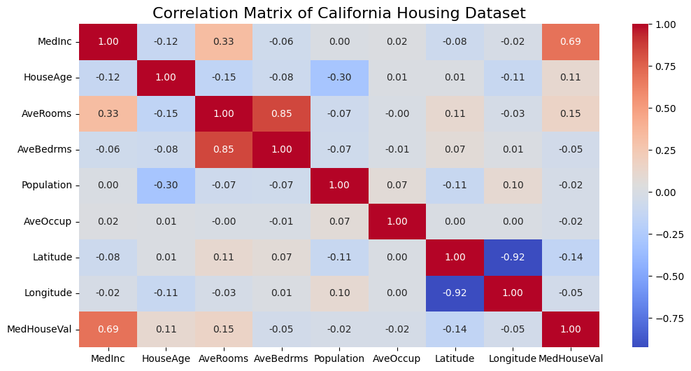
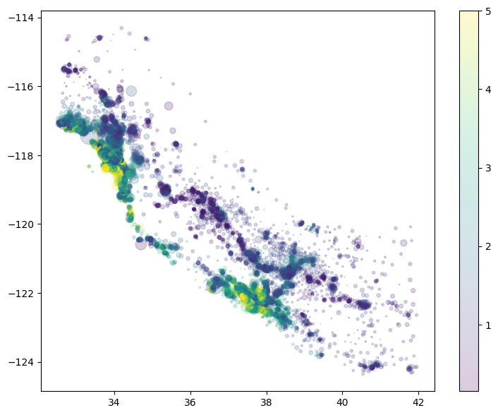
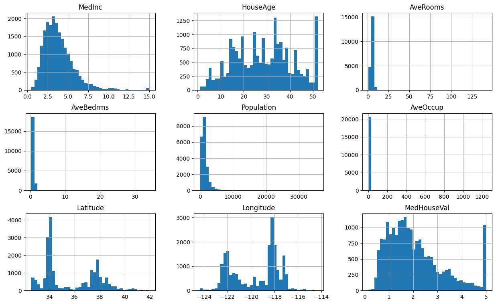
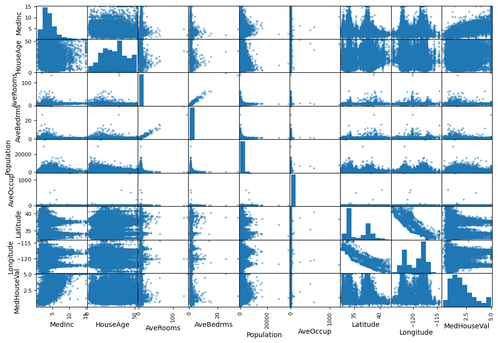

# California Housing Price Prediction

## Problem Description

This project addresses the challenge of predicting median house prices in California districts based on demographic and geographic features. Real estate investors, homebuyers, and property developers can use this model to:

- Estimate fair market values for properties in different neighborhoods
- Identify undervalued areas for investment opportunities
- Understand which factors most significantly impact housing prices
- Make data-driven decisions in the California real estate market

The model takes as input features like median income, house age, average rooms, location coordinates, and population density to predict the median house value for a given block group. This is a **regression problem** where we aim to minimize the prediction error (RMSE) while maintaining interpretability of the results.

**Why this matters:** With California's dynamic and expensive housing market, accurate price predictions help reduce information asymmetry and enable better financial planning for stakeholders across the real estate ecosystem.

---

## Dataset

We use the **California Housing Dataset** from scikit-learn, which contains 20,640 instances based on 1990 California census data.

**Features:**
- `MedInc`: Median income in block group (in tens of thousands of dollars)
- `HouseAge`: Median house age in block group (years)
- `AveRooms`: Average number of rooms per household
- `AveBedrms`: Average number of bedrooms per household
- `Population`: Block group population
- `AveOccup`: Average number of household members
- `Latitude`: Block group latitude
- `Longitude`: Block group longitude

**Target Variable:**
- `MedHouseVal`: Median house value for California districts (in hundreds of thousands of dollars)

The dataset is publicly available and automatically downloaded via the sklearn library, requiring no manual data retrieval.

---

## Project Structure

```
midterm/
│
├── .dockerignore              # List files which are excluded from the Docker image
├── .gitignore                 # List files which are excluded from the Git/GitHub repo
├── Dockerfile                 # Container configuration
├── docker-compose.yaml        # Configuration file to run Docker image
├── model.pkl                  # Saved trained model (generated after training)
├── notebook.ipynb             # EDA, feature analysis, model experiments
├── predict.py                 # Script to load model and make predictions
├── README.md                  # Project documentation (this file)
├── requirements.txt           # Python dependencies for Docker image build
├── requirements_dev.txt       # Python dependencies for local application test
├── scaler.pkl                 # Saved initial data transformer (generated after training)
├── serve.py                   # Flask API for model deployment
├── train.py                   # Script to train and save the final model
├── data/                      # Dataset (auto-downloaded from sklearn)
└── templates/                 # Flask templates
```

---

## Setup Instructions

### Prerequisites
- Python 3.11+
- Docker (optional, for containerized deployment)

### Local Setup

1. **Clone the repository:**
```bash
git clone https://github.com/dataops95/ml-zoomcamp-homeworks-2025.git
cd ml-zoomcamp-homeworks-2025/midterm
```

2. **Create and activate virtual environment:**
```bash
python -m venv venv
source venv/bin/activate  # On Windows: venv\Scripts\activate
```

3. **Install dependencies:**
```bash
pip install -r requirements.txt
```

4. **Run the Jupyter notebook (optional):**
```bash
jupyter notebook notebook.ipynb
```

5. **Train the model:**
```bash
python train.py
```
This will generate `model.pkl` containing the trained model.

6. **Start the prediction service:**
```bash
python serve.py
```
The API will be available at `http://localhost:9696`

---

## Docker Deployment

### Build the Docker image:
```bash
docker build -t california-housing-predictor .
```

### Run the container:
```bash
docker run -it --rm -p 9696:9696 california-housing-predictor
```

The service will be accessible at `http://localhost:9696`

---

## API Usage

### Health Check
```bash
curl http://localhost:9696/health
```

**Response:**
```json
{"status": "healthy"}
```

### Make a Prediction
```bash
curl -X POST http://localhost:9696/predict \
  -H "Content-Type: application/json" \
  -d '{
    "MedInc": 8.3252,
    "HouseAge": 41.0,
    "AveRooms": 6.984127,
    "AveBedrms": 1.023810,
    "Population": 322.0,
    "AveOccup": 2.555556,
    "Latitude": 37.88,
    "Longitude": -122.23
  }'
```

**Response:**
```json
{
  "predicted_price": 452700.50,
  "model_version": "1.0"
}
```

---

## Modeling Approach

### Evaluation Metric
We use **Root Mean Squared Error (RMSE)** as the primary metric because:
- It penalizes large errors more heavily than MAE
- Results are in the same units as the target (hundreds of thousands of dollars)
- Widely accepted standard for regression problems

### Models Trained
1. **Baseline:** Linear Regression
2. **Tree-based:** Random Forest Regressor
3. **Gradient Boosting:** XGBoost

Each model underwent hyperparameter tuning using GridSearchCV with 5-fold cross-validation.

### Feature Engineering
- Standardized numeric features for linear models
- Encoded categorical features (if any added during EDA)

---

## Exploratory Data Analysis Highlights

Key findings from `notebook.ipynb`:

- **Strong positive correlation** between median income and house value (r ≈ 0.69)
- **Geographic clustering** of expensive properties (coastal areas)
- **Non-linear relationships** detected between latitude/longitude and price
- **Feature importance:** Median income dominates, followed by location and house age
- **No missing values** in the dataset
- **Outliers detected** in AveRooms and AveBedrms (handled via capping)

Visualizations include:  
- Correlation heatmaps  
  

- Geographic scatter plots with price overlays  
  

- Distribution plots for all features
   

- Feature importance rankings  
 


---

## Results

| Model                | MAE       | RMSE        | R^2   |
|---------------------|------------|-------------|-------|
| Linear Regression   | 0.5332     | 0.7456      | 0.5758|
| Random Forest       | 0.3274     | 0.5051      | 0.8053|
| **XGBoost**         | **0.2987** | **0.4637**  | **0.8359**|


**Final Model Selected:** XGBoost with tuned hyperparameters (`n_estimators=300, learning_rate=0.05, max_depth=10, random_state=42`)

---

## Known Limitations & Future Work

**Limitations:**
- Data from 1990 census—not representative of current market conditions
- Block group aggregation loses granular property-level details
- Model doesn't account for market trends, interest rates, or economic factors

**Potential Improvements:**
- Incorporate recent data sources (Zillow, Redfin APIs)
- Add time-series features for trend analysis
- Experiment with deep learning architectures (e.g., neural networks with embeddings for location)
- Deploy automatic retraining pipeline for model drift detection

---

## Cloud Deployment (Bonus)

*Instructions for deploying to cloud platforms:*

### AWS Elastic Beanstalk
```bash
eb init -p python-3.11 california-housing-api
eb create housing-env
eb deploy
```

### Google Cloud Run
```bash
gcloud builds submit --tag gcr.io/PROJECT_ID/california-housing
gcloud run deploy --image gcr.io/PROJECT_ID/california-housing --platform managed
```

### Azure Container Instances
```bash
az container create --resource-group myResourceGroup \
  --name california-housing --image california-housing-predictor \
  --dns-name-label california-housing-api --ports 9696
```

---

## Dependencies

See `requirements.txt` for full list. Key dependencies:
- `scikit-learn==1.5.2`
- `xgboost==2.1.2`
- `pandas==2.2.3`
- `numpy==1.26.4`
- `flask==3.0.3`
- `matplotlib==3.9.2`
- `seaborn==0.13.2`

---

## Testing

Run API tests:
```bash
python tests/test_api.py
```

Expected output: All tests pass with status code 200 and valid JSON responses.

---

## Contributing

This is a course project, but suggestions are welcome! Please open an issue or submit a pull request.

---

## License

This project is for educational purposes as part of the ML Zoomcamp 2025 course.

---

## Contact

**Author:** DataOps95  
**Repository:** [ml-zoomcamp-homeworks-2025](https://github.com/dataops95/ml-zoomcamp-homeworks-2025)  
**Course:** [ML Zoomcamp by DataTalks.Club](https://github.com/DataTalksClub/machine-learning-zoomcamp)

---

## Acknowledgments

- Dataset source: [Scikit-learn California Housing Dataset](https://scikit-learn.org/stable/modules/generated/sklearn.datasets.fetch_california_housing.html)
- Based on: Pace, R. Kelley, and Ronald Barry. "Sparse spatial autoregressions." Statistics & Probability Letters 33.3 (1997): 291-297.
